# RFC-001: SoftMeter — Plataforma de Metrologia de Qualidade de Software

**Engenharia de Software – Católica SC**

---

# Identificação

- **Título do Projeto:**
  SoftMeter — Plataforma de Inspeção e Metrologia de Qualidade de Software

- **Linha de Projeto (Direction):**
  Web App

- **Autor:**
  Diego Cunha

- **Data da Proposta original:**
  12/04/2026

- **Data desta revisão:**
  16/09/2026

- **Versão:**
  2.0 — revisão pós-implementação do MVP (v1.0 avaliada pelo comitê em anexo, seção 10)

---

# Nota sobre esta revisão (v2.0)

A versão 1.0 deste RFC (avaliada pelo Prof. Manseira — parecer completo na seção 10) descrevia
uma plataforma genérica: o usuário cadastrava "Sistemas" e "Requisitos" com tolerâncias livres,
abria "Ciclos de Teste" e **digitava manualmente** os valores medidos, a partir dos quais o
sistema calculava um Laudo de Conformidade.

Entre a proposta e esta revisão, o projeto passou por um pivô de arquitetura registrado
formalmente (ADR-003): o SoftMeter deixou de ser um formulário genérico de medições manuais e
passou a ser uma plataforma que **analisa automaticamente o código-fonte de repositórios GitHub
reais**, calculando 6 métricas de qualidade de software objetivas (Complexidade Ciclomática,
LOC, Índice de Manutenibilidade, Cobertura de Testes, Acoplamento e Score de Duplicação) sem
nenhuma digitação manual de valores.

Esse pivô não foi apenas uma escolha de conveniência técnica — ele responde diretamente às
falhas mais sérias apontadas no parecer da v1.0, em especial os dois "Pontos Cegos": a ausência
de cadeia de custódia dos dados medidos, e a variabilidade não controlada do ambiente de teste.
A seção **"Resposta ao Parecer do Prof. Manseira"** (após a seção 9) detalha, ponto a ponto, o
que foi resolvido pela nova arquitetura, o que foi parcialmente resolvido e o que permanece como
limitação conhecida — sem maquiar o que ainda não foi endereçado.

Esta revisão também substitui as descrições textuais de tela por **capturas de tela reais da
aplicação em execução** (seção 4), e todo o conteúdo técnico (requisitos, modelo de dados,
arquitetura, cronograma) passa a refletir o que está de fato implementado e testado — não mais
uma proposta.

---

# 1. Visão do Produto e Impacto (O Problema)

O objetivo desta seção é responder uma pergunta fundamental:

**Este projeto resolve um problema real ou é apenas um exercício técnico?**

> É um problema real, vivido diariamente por equipes de desenvolvimento e gestores de TI:
> softwares são entregues como "prontos" sem que existam critérios objetivos e quantitativos
> que comprovem essa afirmação.

---

## 1.1 Contexto e Problema

A indústria manufatureira opera há décadas sob um princípio inegociável: nenhuma peça é aceita sem medição. Tolerâncias dimensionais, laudos de inspeção e certificações metrológicas garantem que cada componente entregue atende precisamente ao que foi projetado. Um furo fora de centro por décimos de milímetro é motivo de rejeição imediata — não por subjetividade, mas porque existe um protocolo claro de medição e conformidade.

A Engenharia de Software, por sua vez, enfrenta um paradoxo persistente: **sistemas são entregues como "prontos" e "funcionando" sem que critérios objetivos de aceitação tenham sido rigorosamente definidos e medidos.** Um código-fonte pode estar coberto de funções longas, duplicadas e fortemente acopladas, e ainda assim ser entregue como "funcionando" — porque não existe um protocolo de inspeção equivalente ao da metrologia industrial.

Na ausência de métricas quantitativas claras e **coletadas de forma automática e verificável**, a qualidade de software torna-se uma percepção — e percepções variam entre clientes, desenvolvedores e gestores. Pior: quando a coleta depende de digitação manual, a própria medição perde credibilidade, pois quem mede é frequentemente quem tem interesse na aprovação.

**Quem sofre com esse problema:**
- Gestores de TI que não conseguem provar objetivamente se o código entregue atende a um padrão mínimo de qualidade
- Equipes de QA e revisores de código que avaliam pull requests sem critérios numéricos de aceitação definidos
- Desenvolvedores que não sabem quando um módulo está "complexo demais" ou "duplicado demais" por falta de uma referência clara
- Orientadores e bancas acadêmicas que avaliam projetos de conclusão de curso sem uma métrica objetiva de maturidade técnica do código entregue

**Como é resolvido atualmente:**
- Revisão de código informal, baseada em percepção subjetiva do revisor
- Ferramentas de análise estática (SonarQube e similares) que reportam métricas técnicas, mas sem o vocabulário e o rigor formal de um laudo de conformidade
- Planilhas de acompanhamento preenchidas manualmente, sem coleta automática nem rastreabilidade da fonte do dado

**Limitações das soluções atuais:**
- Ferramentas de qualidade de código reportam números, mas não os apresentam como um protocolo de inspeção com valor nominal, tolerância e status de conformidade
- Nenhuma ferramenta disponível traduz os conceitos maduros da metrologia industrial (VIM, tolerância, laudo) para métricas de código-fonte

**Exemplo real do problema (dado real, coletado nesta revisão):**

Ao analisar o repositório público `SandroMachiniski-SE/Viaje-Mais` com o SoftMeter, o Score de
Duplicação medido foi de **49,70%** — quase metade do código-fonte está em blocos duplicados —
contra um limite de especificação de ≤ 15% (Condicional) e ≤ 5% (Conforme). Sem uma ferramenta
como o SoftMeter, esse número simplesmente não existe: o time trabalha sem saber que está
acumulando uma dívida técnica de manutenção mensurável e comparável a um "fora de tolerância"
industrial. Com o SoftMeter, o resultado é objetivo: `Score de Duplicação: Limite ≤15% |
Medido 49,70% | Status: Não-Conforme`, calculado automaticamente a partir do código real, sem
nenhuma digitação manual.

---

## 1.2 Origem da Demanda e Evidências

É necessário demonstrar que existe **interesse real pela solução**.

### Demanda Externa — Contexto Profissional do Autor

O projeto nasce da experiência profissional direta do autor como **técnico de metrologia dimensional** — operador de Braço de Medição FARO e software PolyWorks em ambiente de fabricação de peças de precisão (Quality Ferramentaria, Joinville/SC) — que, durante a transição de carreira para a Engenharia de Software, identificou a ausência de rigor metrológico nas práticas de QA das empresas que conheceu.

A observação central motivadora: **a mesma empresa que rejeitaria uma peça por 0,1 mm de desvio aceita um software com dívida técnica alta (código complexo, duplicado, pouco testado) sem que isso seja sequer medido**, simplesmente porque não existe um protocolo de inspeção equivalente.

---

### Pesquisa com Usuários

A proposta original foi apresentada a profissionais de tecnologia com perfis alinhados às personas do projeto, incluindo analistas de QA, desenvolvedores e gestores de TI. As principais dores identificadas foram:

| Dor relatada | Frequência |
|---|---|
| "Não sei como justificar para o cliente que o sistema está dentro do esperado" | Alta |
| "Fazemos revisão de código mas não temos critérios numéricos de aceitação" | Alta |
| "Não sei quando uma funcionalidade está 'boa o suficiente' para subir para produção" | Média |

**Padrão observado:** todos os participantes reconheceram o conceito de tolerância metrológica aplicada ao software como intuitivo e de fácil compreensão, especialmente após a analogia com a metrologia industrial.

---

### Evidência de Interesse Acadêmico

A crítica de Sommerville (2011) — *"a ideia de tolerâncias não é aplicável aos sistemas digitais"* — evidencia exatamente o gap que este projeto se propõe a preencher: não há ferramentas que tornem essa aplicação prática e acessível. O SoftMeter posiciona-se como uma resposta direta a essa lacuna identificada na literatura, agora com uma implementação funcional que calcula tolerâncias sobre métricas de código-fonte reais.

---

## 1.3 Análise de Soluções Existentes (Benchmark)

*(Atualizado na v2.0 para refletir o domínio real do produto — análise estática de qualidade de código, não gestão de casos de teste manuais)*

### SonarQube / SonarCloud
- **Link:** https://www.sonarqube.org
- **Público-alvo:** Equipes de desenvolvimento
- **Funcionalidades:** Análise estática de código, detecção de bugs, code smells, cobertura de testes, métricas de dívida técnica
- **Limitações:** Reporta números técnicos (complexidade, duplicação, cobertura) mas não os apresenta com o vocabulário formal de laudo de conformidade metrológico (valor nominal, tolerância, status Conforme/Condicional/Não-Conforme). Não referencia a fonte bibliográfica de cada métrica.

### CodeClimate
- **Link:** https://codeclimate.com
- **Público-alvo:** Times de desenvolvimento que já usam GitHub/GitLab
- **Funcionalidades:** Nota de manutenibilidade por repositório, cobertura de testes, detecção de duplicação
- **Limitações:** Índice de manutenibilidade proprietário e não documentado publicamente (sem fórmula nem fonte bibliográfica citável); sem geração de relatório PDF formal para entrega a terceiros.

### Codacy
- **Link:** https://www.codacy.com
- **Público-alvo:** Equipes de desenvolvimento e code review automatizado
- **Funcionalidades:** Análise estática multi-linguagem, gate de qualidade em pull requests
- **Limitações:** Foco em encontrar issues pontuais no código (estilo binário aprovado/reprovado por regra), sem o conceito de tolerância numérica por métrica nem índice agregado de conformidade.

### Better Code Hub
- **Link:** https://bettercodehub.com
- **Público-alvo:** Desenvolvedores individuais e pequenos times
- **Funcionalidades:** 10 "guidelines" de código limpo avaliadas automaticamente
- **Limitações:** Resultado binário por guideline (atende/não atende), sem valor medido nem tolerância numérica explícita, sem relatório rastreável para entrega formal.

---

### Comparação

| Solução | Pontos Fortes | Limitações |
|---|---|---|
| SonarQube / SonarCloud | Análise de código profunda, integração CI/CD, maturidade de mercado | Sem vocabulário de laudo metrológico; sem fonte bibliográfica por métrica |
| CodeClimate | Nota única fácil de comunicar | Fórmula do índice não documentada; sem relatório PDF formal |
| Codacy | Integração forte com pull requests | Resultado binário por regra, sem tolerância numérica nem índice agregado |
| Better Code Hub | Simplicidade, poucas guidelines | Resultado binário, sem valor medido nem laudo rastreável |

---

### Diferencial do Projeto

O **SoftMeter** preenche uma lacuna específica não atendida por nenhuma das soluções acima:

1. **Define tolerâncias por métrica, com fonte bibliográfica** — cada uma das 6 métricas do catálogo tem fórmula, unidade e referência bibliográfica documentadas (Princípio V da constituição do projeto — rastreabilidade metrológica não-negociável)
2. **Classifica automaticamente por conformidade** — o valor medido é comparado ao limite de especificação e classificado como Conforme / Condicional / Não-Conforme
3. **Emite Laudo de Conformidade em PDF** — documento estruturado com índice percentual de conformidade, classificação final, e agora (v2.0) um resumo interpretativo com pontos fortes e pontos de atenção específicos
4. **Coleta 100% automática, sem digitação manual** — todo valor medido vem do código-fonte real (baixado via API do GitHub) ou de um artifact de CI já publicado; não há campo onde um usuário insira um número "à mão"
5. **Acessível a pequenas equipes** — repositório GitHub público é suficiente; sem necessidade de infraestrutura complexa ou licenças caras

---

## 1.4 Público-Alvo

**Perfil primário — Desenvolvedores e mantenedores de repositórios**
- Querem saber objetivamente se seu código está "dentro da tolerância" de complexidade, duplicação e manutenibilidade
- Contexto: projetos pessoais, times ágeis, ou (como demonstrado nesta revisão) o próprio código de um TCC
- Nível técnico: intermediário a avançado
- Principal ganho: critério objetivo e comparável ao longo do tempo (histórico e tendência)

**Perfil secundário — Analistas de QA / Revisores de código**
- Precisam de critérios numéricos ao revisar a saúde de um repositório antes de aprovar uma entrega
- Contexto: equipes de desenvolvimento de pequeno e médio porte
- Nível técnico: intermediário
- Principal ganho: laudo formal em PDF para anexar a uma entrega ou revisão

**Perfil terciário — Orientadores e avaliadores acadêmicos**
- Precisam de evidência objetiva da maturidade técnica de um projeto de conclusão de curso
- Contexto: avaliação de TCCs de Engenharia de Software
- Nível técnico: avançado
- Principal ganho: relatório rastreável, com fórmula e fonte bibliográfica por métrica — adequado para citação em um trabalho acadêmico

---

## 1.5 Objetivos do Projeto

### Objetivo Geral

Desenvolver o **SoftMeter**, uma plataforma web que implementa o framework de Metrologia de Software: um protocolo estruturado que transpõe os conceitos da metrologia industrial (tolerância, desvio, conformidade, laudo) para métricas de qualidade de código-fonte, coletadas de forma **100% automática** a partir de repositórios GitHub reais, permitindo avaliar quantitativamente a maturidade técnica de um software e gerar Laudos de Conformidade objetivos e rastreáveis.

---

### Objetivos Específicos

- Mapear e transpor os conceitos do Vocabulário Internacional de Metrologia (VIM) para equivalentes no domínio de qualidade de código, fundamentando o catálogo de métricas com base em literatura reconhecida (McCabe, Martin, Coleman et al., normas ISO/IEC 25010)
- Implementar o cadastro de repositórios GitHub públicos e a execução de análise automática das 6 métricas do catálogo, sem qualquer valor inserido manualmente pelo usuário
- Implementar o registro histórico de análises com cálculo automático de tendência (melhorando / piorando / estável) por métrica entre execuções
- Implementar a geração automática de Laudo de Conformidade em PDF, rastreável a fórmula e fonte bibliográfica de cada métrica
- Validar o framework por meio da análise de repositórios reais de terceiros e do próprio SoftMeter, demonstrando a geração de laudos completos com índice de conformidade calculado
- Disponibilizar a plataforma em ambiente containerizado (Docker Compose) com pipeline CI/CD configurado e cobertura de testes automatizados ≥ 80% no backend e no frontend

---

## 1.6 Métricas de Sucesso (KPIs)

*(Atualizado na v2.0: o KPI "redução de 50% no tempo de documentação de QA" da v1.0 foi removido — o parecer do comitê identificou corretamente que ele não tinha método de medição definido nem baseline. Os KPIs abaixo são objetivos, mensuráveis e já verificados nesta revisão.)*

| KPI | Meta | Resultado verificado nesta revisão |
|---|---|---|
| Cobertura de testes automatizados (backend) | ≥ 80% | **92%** (145 testes, pytest) |
| Cobertura de testes automatizados (frontend) | ≥ 80% | **86%** (28 testes, Jest) |
| Tempo de análise síncrona (repositório pequeno/médio) | < 10s (p95) | Verificado por teste de performance dedicado; repositórios acima do limiar usam fila assíncrona (Celery/Redis) sem bloquear a interface |
| Cenários E2E cobertos (Playwright) | 1 por user story | **8/8** cenários passando, cobrindo as 5 user stories |
| Métricas com fórmula, unidade e fonte bibliográfica documentadas | 6/6 | **6/6** (catálogo completo, Princípio V) |
| Pipeline CI/CD executando a cada push | Sim | Sim — GitHub Actions, jobs de lint + type-check + testes para backend e frontend |

---

# 2. Engenharia de Requisitos

Esta seção define **o que o sistema fará**. Substituída integralmente na v2.0 para refletir o
domínio real (análise de repositórios, não gestão de sistemas/requisitos/ciclos genéricos) — a
especificação completa e versionada vive em `specs/001-softmeter-plataforma-mvp/spec.md`.

---

## 2.1 Personas

### Persona 1 — Ana Souza, Desenvolvedora / Analista de QA

- **Idade:** 28 anos
- **Contexto:** Trabalha em uma softwarehouse de médio porte, revisando código de 3 produtos simultaneamente.
- **Objetivos:** Ter critérios claros e automáticos sobre a saúde de um repositório antes de aprovar uma entrega.
- **Principais dificuldades:** Revisão de código baseada em "achismo", sem métricas objetivas nem histórico comparável entre versões.

---

### Persona 2 — Carlos Mendes, Gerente de TI

- **Idade:** 42 anos
- **Contexto:** Gerencia a entrega de sistemas para clientes que exigem evidência técnica formal como parte do aceite.
- **Objetivos:** Ter um documento (o Laudo de Conformidade) que prove objetivamente a qualidade do código entregue.
- **Principais dificuldades:** Não existe nenhum "documento de conformidade" padronizado que os desenvolvedores emitam sobre a qualidade do próprio código.

---

### Persona 3 — Rafael Lima, Desenvolvedor Backend / Autor de TCC

- **Idade:** 25 anos, em início de carreira
- **Contexto:** Mantém repositórios pessoais e de portfólio e quer demonstrar objetivamente a maturidade técnica do seu próprio código a um orientador ou recrutador.
- **Objetivos:** Saber se seu repositório está "dentro da tolerância" de complexidade e duplicação antes de apresentá-lo.
- **Principais dificuldades:** Não tem uma métrica objetiva e citável para provar qualidade técnica além de "os testes passam".

---

## 2.2 Casos de Uso Principais

1. Criar conta e autenticar-se na plataforma
2. Cadastrar um repositório GitHub público (Python, JavaScript ou TypeScript)
3. Disparar uma análise automática do repositório
4. Visualizar o resultado em um dashboard de gauges metrológicos (valor medido, limites, status)
5. Consultar o histórico de análises e a tendência de cada métrica
6. Gerar um Laudo de Conformidade em PDF, para uma análise individual ou para o histórico completo
7. Remover um repositório cadastrado

**Fluxo principal:**
```
Cadastro/Login → Repositórios → Cadastrar URL do GitHub → Executar análise
→ Dashboard de Gauges → Histórico e Tendências → Gerar Relatório PDF
```

---

## 2.3 Requisitos Funcionais (RF)

*(Correspondem 1:1 a FR-001–FR-015 de `specs/001-softmeter-plataforma-mvp/spec.md`, implementados e cobertos por teste de integração)*

**Autenticação**

RF01 — O sistema deve exigir que o usuário esteja autenticado (conta criada e login realizado) antes de cadastrar repositórios ou visualizar dashboards, histórico ou relatórios.

RF02 — O sistema deve restringir os repositórios, análises e relatórios de cada usuário à visibilidade exclusiva da própria conta.

**Gestão de Repositórios**

RF03 — O sistema deve permitir que um usuário autenticado cadastre um repositório GitHub público informando sua URL.

RF04 — O sistema deve validar que a(s) linguagem(ns) principal(is) do repositório seja(m) Python e/ou JavaScript/TypeScript, rejeitando o cadastro com mensagem clara caso contrário.

RF05 — O sistema deve impedir o cadastro duplicado da mesma URL de repositório dentro da conta do mesmo usuário.

RF06 — O sistema deve rejeitar tentativas de análise sobre repositórios inacessíveis (privados, renomeados ou excluídos), informando o motivo da falha.

**Análise Automática**

RF07 — O sistema deve permitir que o usuário dispare uma execução de análise automática para qualquer repositório que tenha cadastrado, exclusivamente sob demanda.

RF08 — O sistema deve calcular, em cada execução, as 6 métricas do catálogo: Complexidade Ciclomática, LOC, Índice de Manutenibilidade, Cobertura de Testes, Acoplamento e Score de Duplicação — sem nenhum valor inserido manualmente.

RF09 — O sistema deve comparar o valor medido de cada métrica com seus limites de especificação fixos e classificá-la como Conforme, Condicional ou Não-Conforme.

RF10 — O sistema deve persistir cada execução de análise como um registro histórico, incluindo data/hora e todos os valores calculados.

**Dashboard e Histórico**

RF11 — O sistema deve exibir os resultados da análise em um dashboard no formato de gauge metrológico, mostrando para cada métrica: valor medido, limites de especificação e status de conformidade.

RF12 — O sistema deve permitir que o usuário visualize a sequência histórica de análises de um repositório e a tendência (melhora/piora/estável) de cada métrica entre execuções.

**Relatórios**

RF13 — O sistema deve permitir que o usuário gere um relatório em PDF de uma análise individual ou do histórico completo de um repositório, contendo: identificação do repositório, data, valor medido, limites de especificação, status de conformidade e a fonte bibliográfica de cada métrica.

RF14 — O relatório deve incluir um resumo interpretativo automático (pontos fortes, pontos de atenção com implicação prática, e a conta do índice agregado) — adicionado na v2.0 (ver ADR extensão de cobertura).

RF15 — O sistema deve definir, para cada métrica, limites de especificação fixos baseados em literatura reconhecida, sem permitir customização por usuário nesta versão.

---

## 2.4 Requisitos Não Funcionais (RNF)

RNF01 — O sistema deve concluir a análise síncrona de um repositório pequeno/médio em até 10 segundos (p95); repositórios maiores devem ser processados de forma assíncrona (fila), sem bloquear a interface.

RNF02 — O sistema deve ter cobertura de testes automatizados de no mínimo 80% no backend e no frontend.

RNF03 — O sistema deve ter testes em três camadas (unitário, integração e E2E) para toda funcionalidade nova.

RNF04 — O sistema deve utilizar autenticação com JWT (access token de curta duração + refresh token) e senhas com hash bcrypt.

RNF05 — O sistema deve ter pipeline CI/CD configurado via GitHub Actions, com execução automática de lint, checagem de tipos e testes a cada push.

RNF06 — O sistema deve utilizar banco de dados PostgreSQL e ser executável via Docker Compose em ambiente local idêntico ao de CI.

RNF07 — O sistema deve limitar tentativas de login (rate limiting) para mitigar força bruta na autenticação.

RNF08 — O dashboard deve usar um único componente de gauge reutilizável para as 6 métricas, com faixas de cor consistentes com a classificação de conformidade do projeto.

RNF09 — Nenhuma métrica pode ser exibida em tela ou relatório sem que sua fórmula, unidade e fonte bibliográfica estejam documentadas no catálogo (rastreabilidade metrológica não-negociável).

> **Nota sobre `RNF02 — Disponibilidade em produção` da v1.0:** este RFC não afirma mais um
> requisito de deploy em ambiente de produção público. Até esta revisão, a aplicação roda em
> ambiente containerizado local (Docker Compose) e foi validada em profundidade nesse ambiente;
> o deploy em nuvem pública permanece como item do cronograma (seção 7), não como requisito já
> atendido — divergência da v1.0 registrada aqui com transparência.

---

## 2.5 Regras de Negócio

RN01 — O índice de conformidade geral é a média dos escores por métrica avaliável (Conforme = 100, Condicional = 50, Não-Conforme = 0), excluindo métricas com status "Não disponível".

RN02 — Classificação final: Conforme (índice ≥ 90%), Condicional (70%–89%), Não-Conforme (< 70%).

RN03 — A métrica de Cobertura de Testes pode ser classificada como "Não disponível" quando nenhuma fonte de dado é encontrada (artifact de CI, arquivo versionado ou badge); esse status é excluído do cálculo do índice, nunca contando como reprovação.

RN04 — Apenas o usuário proprietário de um repositório pode cadastrá-lo, analisá-lo, consultar seu histórico ou gerar relatórios sobre ele.

RN05 — A mesma URL de repositório não pode ser cadastrada duas vezes pela mesma conta.

> **Nota sobre `RN06` da v1.0 (peso por criticidade):** a v1.0 previa que uma métrica de
> criticidade "Crítica" reprovada forçasse Não-Conforme independentemente do índice geral. O
> catálogo de métricas implementado **não distingue criticidade entre as 6 métricas** — todas
> têm o mesmo peso no índice agregado (RN01). Esta é uma simplificação real e deliberada desta
> versão, não uma correção da crítica do comitê sobre o índice ser "simplista" — ver seção de
> resposta ao parecer.

---

## 2.6 Fora do Escopo

- Repositórios GitHub privados (exige autenticação OAuth adicional, não implementada nesta versão)
- Linguagens além de Python, JavaScript e TypeScript
- Customização de limites de especificação por usuário ou por repositório
- Agendamento automático de análises em segundo plano (toda análise é disparada sob demanda)
- Colaboração multiusuário sobre o mesmo repositório (cada repositório pertence exclusivamente a quem o cadastrou — ver limitação discutida na resposta ao parecer)
- Execução da suíte de testes do repositório analisado (decisão de segurança — ver `research.md` item 6 e ADR-004)
- Aplicativo mobile nativo (iOS/Android)
- Suporte a múltiplos idiomas (apenas português brasileiro)

---

# 3. Fluxos e Comportamento do Sistema

Esta seção demonstra **como o sistema funciona**.

---

## 3.1 Fluxo Principal do Usuário

```
[Cadastro / Login]
        ↓
[Repositórios — lista de repositórios cadastrados pelo usuário]
        ↓
[Cadastrar repositório — URL pública do GitHub]
  └── Linguagem validada automaticamente via API do GitHub
        ↓
[Executar análise]
  ├── Repositório pequeno/médio → resultado síncrono (<10s)
  └── Repositório grande → fila Celery/Redis, status "processando"
        ↓
[Dashboard de Conformidade — 6 gauges]
  ├── Valor medido, limites, status por métrica
  └── Conformidade geral: Conforme / Condicional / Não-Conforme
        ↓
[Histórico e Tendências] ←→ [Gerar Relatório PDF]
```

---

## 3.2 Fluxos Alternativos

**Repositório com linguagem não suportada:**
O cadastro é rejeitado com mensagem explicando que apenas Python, JavaScript e TypeScript são suportados nesta versão.

**Repositório inacessível no momento da análise (renomeado, excluído ou tornado privado):**
A análise é marcada como "falhou", com o motivo registrado, sem derrubar o restante da aplicação.

**Cobertura de Testes sem fonte disponível:**
A métrica é exibida como "Não disponível" no dashboard e excluída do cálculo do índice agregado — não é contada como reprovação.

**Tentativa de acesso sem autenticação:**
Qualquer rota protegida da API retorna HTTP 401. O frontend redireciona automaticamente para a tela de login.

**Análise assíncrona travada por falha de infraestrutura:**
Corrigido nesta revisão — dois bugs reais no caminho assíncrono (worker Celery não registrava a tarefa; resolução de mapeamento SQLAlchemy dependente de ordem de import) foram identificados por teste manual, corrigidos na raiz e cobertos por testes de regressão que reproduzem o isolamento de processo do worker.

---

# 4. Capturas de Tela da Aplicação (UX)

*(Substituída integralmente na v2.0 — a v1.0 apresentava apenas descrições textuais de tela, o
que o parecer do comitê identificou corretamente como uma lacuna para um projeto com conceito
visual forte. As imagens abaixo são capturas reais da aplicação em execução, geradas nesta
revisão.)*

## 4.1 Fluxo de Navegação Real

```
/login                                              → autenticação
/register                                           → criação de conta
/repositories                                       → lista + cadastro de repositórios
/repositories/:repositoryId/analyses/:analysisId    → Dashboard de Conformidade (6 gauges)
/repositories/:repositoryId/history                 → Histórico e Tendências
```

## 4.2 Tela — Autenticação

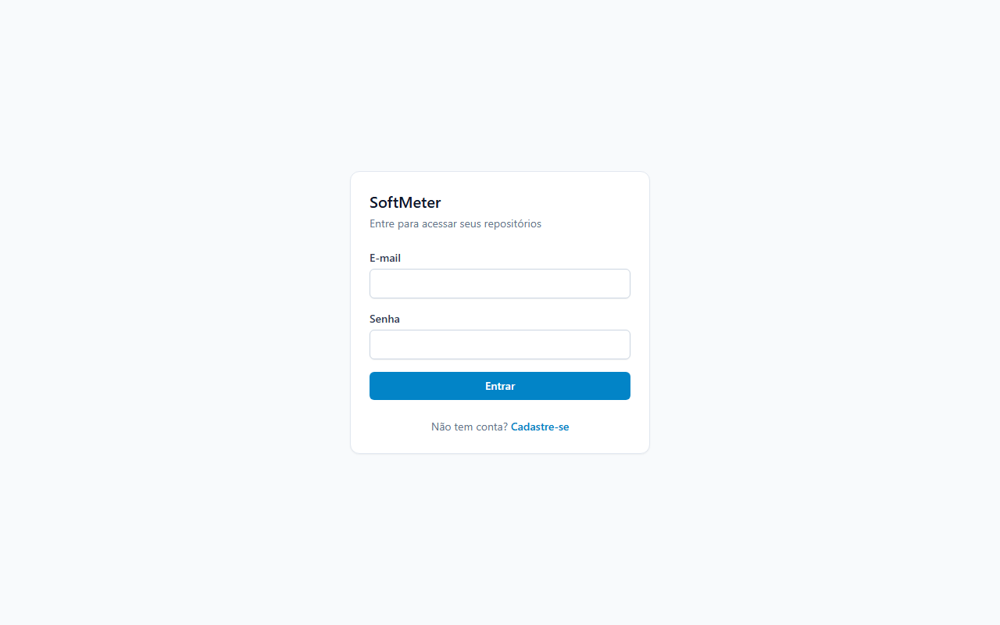

Formulário mínimo (e-mail e senha). Ao criar uma conta, o usuário é autenticado automaticamente
e redirecionado para a lista de repositórios.

## 4.3 Tela — Repositórios

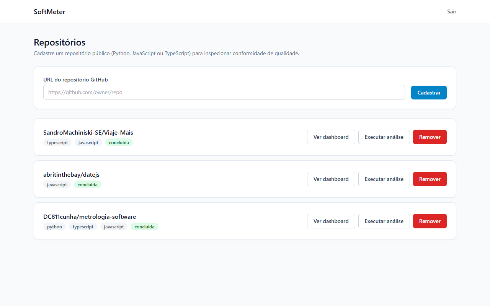

Cada repositório mostra a(s) linguagem(ns) detectada(s) automaticamente pela API do GitHub e o
status da última análise. As ações "Ver dashboard", "Executar análise" e "Remover" ficam
disponíveis por repositório.

## 4.4 Tela — Dashboard de Conformidade

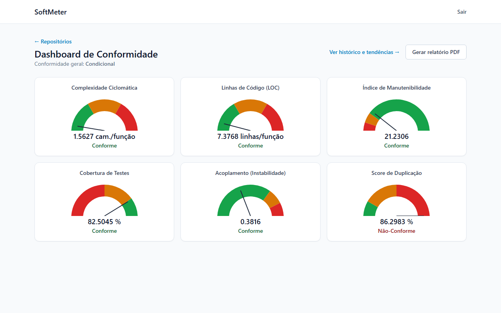

Captura real de uma análise do repositório `abritinthebay/datejs`: os 6 gauges usam sempre o
mesmo componente visual, com a mesma paleta de cores por status (verde/laranja/vermelho),
garantindo consistência de leitura entre métricas (Princípio III da constituição do projeto).
Nesta captura, a Cobertura de Testes aparece preenchida (82,50%) — lida automaticamente do
arquivo `lcov.info` já versionado no repositório analisado.

## 4.5 Tela — Histórico e Tendências

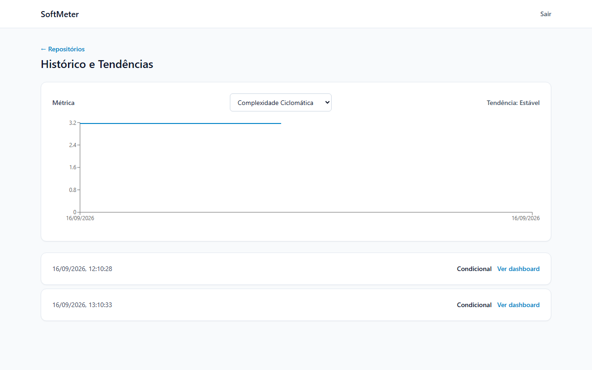

Duas análises reais do repositório `SandroMachiniski-SE/Viaje-Mais`, com a tendência calculada
automaticamente ("Estável", já que o código não mudou entre as duas execuções) e o gráfico de
série temporal por métrica selecionável.

## 4.6 Documento — Laudo de Conformidade em PDF

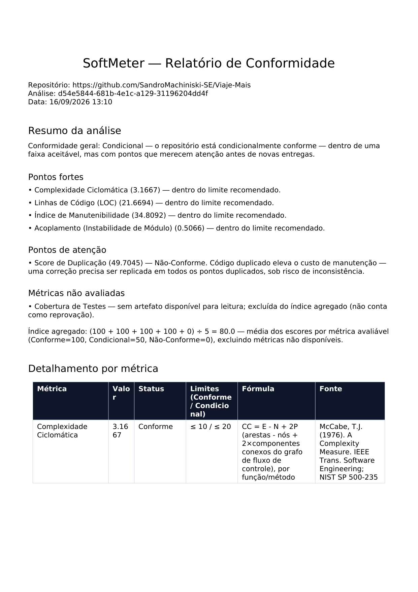

Laudo real, gerado a partir de uma análise do repositório `Viaje-Mais`. A seção "Resumo da
análise" (adicionada nesta revisão) lista pontos fortes e pontos de atenção com a implicação
prática de cada métrica fora do limite, seguida da tabela detalhada com fórmula e fonte
bibliográfica de cada uma das 6 métricas.

---

## 4.7 Feedback Registrado durante o Uso Real

Durante a validação desta revisão, o próprio uso da aplicação gerou um achado de UX real: a tela
de Histórico exibia um gráfico vazio, sem mensagem, quando a métrica selecionada não tinha
nenhum valor disponível em nenhuma análise (ex.: Cobertura de Testes sem fonte). A causa era uma
condição que verificava apenas "a série tem itens" em vez de "a série tem algum valor plotável".
Corrigido e coberto por teste de regressão. Este é um exemplo concreto de como o uso real da
aplicação (e não apenas a leitura da especificação) revela lacunas que nenhuma etapa de design
havia previsto.

---

# 5. Arquitetura do Sistema

Esta seção demonstra **como o sistema foi construído**. Substituída integralmente na v2.0 — a
v1.0 descrevia uma stack Node.js/Express/Jest com 6 tabelas genéricas; o ADR-003 registrou o
pivô para a stack abaixo antes da implementação do MVP.

---

## 5.1 Diagrama C4

### Nível 1 — Diagrama de Contexto

```
┌──────────────────────────────────────────────────────────────────┐
│                                                                  │
│   [Desenvolvedor]   [Analista de QA]   [Orientador/Avaliador]    │
│        │                   │                    │                │
│        └───────────────────┴────────────────────┘                │
│                            │                                     │
│                            ▼                                     │
│                  ┌──────────────────┐        ┌─────────────────┐ │
│                  │   SoftMeter      │───────▶│  API do GitHub   │ │
│                  │   (Web App)      │        │  (código-fonte,  │ │
│                  └──────────────────┘        │  artifacts de CI)│ │
│                                                └─────────────────┘│
│  Atores: usuários autenticados via browser                       │
│  Sistema: SoftMeter (backend API + frontend SPA)                 │
│  Sistema externo: GitHub (repositórios públicos analisados)      │
│                                                                  │
└──────────────────────────────────────────────────────────────────┘
```

**Atores:**
- **Desenvolvedor:** cadastra repositórios, dispara análises, acompanha histórico
- **Analista de QA:** consulta dashboards e gera laudos para revisão de entregas
- **Orientador/Avaliador:** consulta laudos como evidência técnica objetiva

**Sistema externo:** API do GitHub — único sistema externo integrado (linguagens, código-fonte via zipball, artifacts de CI)

---

### Nível 2 — Diagrama de Containers

```
┌──────────────────────────────────────────────────────────────────────┐
│  Usuário (Browser)                                                   │
│                                                                       │
│  ┌────────────────────────────────────────────────────────────────┐  │
│  │  Frontend SPA — React 18 + TypeScript + Vite                   │  │
│  │  Porta: 3000                                                   │  │
│  │  Responsabilidade: telas, roteamento, gauges (Recharts)        │  │
│  └────────────────────────┬───────────────────────────────────────┘  │
│                           │ REST / JSON                              │
│  ┌────────────────────────▼───────────────────────────────────────┐  │
│  │  Backend API — FastAPI + Python 3.12                           │  │
│  │  Porta: 3001                                                   │  │
│  │  Responsabilidade: auth, orquestração de análise (síncrona),   │  │
│  │  classificação de conformidade, geração de PDF                 │  │
│  └────┬──────────────┬──────────────────┬─────────────────┬───────┘  │
│       │ SQL          │ enqueue          │ PDF              │ HTTPS   │
│  ┌────▼──────┐  ┌────▼──────────┐  ┌────▼──────────┐  ┌────▼──────┐  │
│  │PostgreSQL │  │ Redis (broker)│  │ ReportLab     │  │ API GitHub│  │
│  │ 16        │  │               │  │ (biblioteca)  │  │ (externo) │  │
│  └───────────┘  └────┬──────────┘  └───────────────┘  └───────────┘  │
│                      │                                               │
│                 ┌────▼──────────────────────┐                        │
│                 │ Celery Worker              │                       │
│                 │ Análise assíncrona (repos  │                       │
│                 │ grandes) — mesmo motor de  │                       │
│                 │ métricas do backend        │                       │
│                 └────────────────────────────┘                       │
└────────────────────────────────────────────────────────────────────┘
```

---

### Nível 3 — Diagrama de Componentes (Backend API)

```
Backend API (FastAPI)
│
├── api/
│   ├── auth.py            → registro, login, refresh, logout (JWT)
│   ├── repositories.py    → CRUD de repositórios + validação de linguagem
│   ├── analyses.py        → disparo de análise, consulta, histórico/tendência
│   └── reports.py         → geração e download de relatório PDF
│
├── analysis/  (motor de métricas — núcleo de valor do produto)
│   ├── metrics_catalog.py     → ⭐ catálogo fixo: fórmula, unidade, fonte, limites
│   ├── metric_engine.py       → Radon (Python) + tree-sitter (JS/TS): CC, LOC, MI
│   ├── coupling.py            → Instabilidade de Módulo (Martin, 2002)
│   ├── duplication.py         → shingling de tokens normalizados
│   └── coverage_reader.py     → artifact de CI → arquivo versionado → badge (cascata)
│
├── services/
│   ├── github_service.py      → integração com a API do GitHub
│   ├── analysis_runner.py     → orquestra download + 6 métricas + persistência
│   ├── conformity_service.py  → classifica medições, calcula índice agregado
│   ├── trend_service.py       → tendência entre as duas análises mais recentes
│   └── report_service.py      → monta o PDF (ReportLab) com resumo interpretativo
│
├── workers/
│   └── analysis_tasks.py      → task Celery para análise assíncrona
│
└── models/  → User, Repository, Analysis, Measurement, Report (SQLAlchemy)
```

---

## 5.2 Modelo de Dados

**Esquema relacional — 5 tabelas** (substitui as 6 tabelas genéricas da v1.0):

```
users (id, email, senha_hash, criado_em)

repositories (id, usuario_id FK, url, owner_nome, linguagens_detectadas,
              status_acesso, criado_em)
              UNIQUE(usuario_id, url)

analyses (id, repositorio_id FK, status, status_conformidade_geral,
          motivo_falha, solicitada_em, concluida_em)

measurements (id, analise_id FK, metrica_chave, valor_medido,
              status_conformidade)

reports (id, usuario_id FK, repositorio_id FK, analise_id FK NULL,
         tipo, caminho_arquivo, gerado_em)
```

**Relacionamentos:**
- `users` (1) → (N) `repositories`
- `repositories` (1) → (N) `analyses`
- `analyses` (1) → (N) `measurements`
- `repositories` (1) → (N) `reports`

O catálogo das 6 métricas (`metrics_catalog.py`) não é uma tabela do banco — é um catálogo fixo
versionado no código-fonte, por decisão explícita do Princípio V da constituição: nenhuma
métrica pode ser exibida sem que fórmula, unidade e fonte bibliográfica já estejam definidas
*antes* de qualquer tela ou endpoint que a exponha.

---

## 5.3 Principais Componentes

| Componente | Responsabilidade |
|---|---|
| GithubService | Detecção de linguagem, download do código-fonte, leitura de artifacts de CI (ADR-004) |
| Metric Engine (Radon + tree-sitter) | Complexidade Ciclomática, LOC e Índice de Manutenibilidade |
| Coupling / Duplication (parser AST próprio) | Acoplamento (Instabilidade de Módulo) e Score de Duplicação |
| Coverage Reader | Cascata de 4 fontes para Cobertura de Testes (artifact de CI → arquivo versionado → badge) |
| Conformity Service | Classificação por métrica e cálculo do índice agregado |
| Trend Service | Tendência (melhorando/piorando/estável) entre as duas análises mais recentes |
| Report Service | Geração do PDF com resumo interpretativo e tabela detalhada por métrica |

---

## 5.4 Stack Tecnológica

*(Divergência registrada da v1.0: a proposta original definia Node.js + Express + Jest. O
ADR-003 registrou o pivô abaixo antes da implementação, motivado pela maturidade do ecossistema
Python para análise estática de código — núcleo de valor do produto.)*

**FastAPI + Python 3.12**
Ecossistema com bibliotecas de análise estática maduras (Radon), reduzindo o esforço de
implementar o motor de métricas — núcleo de valor do projeto. Assíncrono nativamente, integra-se
bem com filas de processamento em segundo plano.

**PostgreSQL 16**
Banco de dados relacional robusto, com suporte a transações ACID necessário para os cálculos de
conformidade.

**Celery + Redis**
Cumpre o Princípio IV (Performance da Análise, <10s) com degradação graciosa — análises maiores
são despachadas para uma fila em vez de bloquear a requisição HTTP.

**Radon + parser AST próprio (tree-sitter para JS/TS)**
Radon cobre Complexidade Ciclomática, LOC e Índice de Manutenibilidade com fórmulas publicadas e
rastreáveis. Acoplamento e Score de Duplicação exigiram um parser próprio, via módulo `ast` do
Python e tree-sitter para JavaScript/TypeScript.

**React 18 + TypeScript + Vite**
Biblioteca de interface padrão de mercado; Vite como build tool.

**Recharts**
Biblioteca de gráficos React madura, usada tanto nos gauges metrológicos quanto no gráfico de
tendência do histórico.

**ReportLab**
Geração de PDF nativa em Python, sem dependência de serviços externos de renderização.

**JWT (access + refresh) + bcrypt**
Padrão de mercado para autenticação stateless. Detalhado na seção 6.

**Docker + Docker Compose**
Ambiente de desenvolvimento consistente e portável — sobe PostgreSQL, Redis, backend, worker
Celery e frontend com um único comando.

**pytest + Jest + Playwright**
TDD full-stack. 145 testes unitários/integração no backend (pytest), 28 no frontend (Jest), 8
cenários E2E ponta a ponta (Playwright), um por user story.

**GitHub Actions**
Pipeline configurado para lint, checagem de tipos e testes a cada push nas branches protegidas.

---

# 6. Segurança e Privacidade

## 6.1 Proteções Implementadas

**Autenticação e Autorização:**
- JWT com dois tokens de vida diferente: access token de 15 minutos (usado no header
  `Authorization: Bearer`, armazenado em `localStorage` no frontend) e refresh token de 7 dias
  (cookie HTTPOnly). *Divergência registrada da v1.0*, que previa "sem localStorage" para ambos
  os tokens — a mitigação real adotada é a vida curta do token exposto ao JavaScript (15 min),
  não sua ausência total do localStorage.
- Middleware de autenticação (`get_current_user`) aplicado a todas as rotas protegidas
- Senhas com hash bcrypt
- Isolamento de dados por usuário verificado por teste de integração dedicado (`test_data_isolation.py`) — nenhum usuário acessa repositórios, análises ou relatórios de outra conta

**Proteção contra ataques OWASP Top 10:**
- Injeção SQL: ORM (SQLAlchemy) com queries parametrizadas, sem concatenação de strings
- Rate limiting de login: **implementado nesta versão** (10 tentativas/minuto/IP) — item que a v1.0 registrava como "a implementar" e o parecer do comitê apontou como pendência de segurança relevante
- Limite de tamanho de payload: requisições acima de 64 KB são rejeitadas (mitiga payload flooding)
- CORS restrito às origens configuradas
- Validação de entrada: URL de repositório validada por padrão restrito a `github.com/owner/repo`, evitando SSRF via URL arbitrária
- Segredos gerenciados via variáveis de ambiente (`.env`, nunca versionado — confirmado no `.gitignore`)

**Configuração segura:**
- Branch `main` do repositório protegida: exige Pull Request e CI verde antes de merge, com `enforce_admins` ativo (nem o dono do repositório pode contornar a regra)

---

## 6.2 Privacidade e LGPD

**Dados coletados:**
- E-mail e hash de senha do usuário (cadastro)
- URLs de repositórios GitHub públicos cadastrados voluntariamente
- Valores de métricas calculados automaticamente a partir de código-fonte público — nenhum dado pessoal de terceiros é coletado

**Armazenamento:**
- Banco de dados PostgreSQL com acesso restrito por credenciais
- Senhas nunca armazenadas em texto claro (bcrypt)
- Repositórios, análises e relatórios pertencem exclusivamente ao usuário que os cadastrou (RN04)

**Direitos do titular (Art. 18, LGPD):**
- Não há coleta de dados sensíveis (saúde, financeiros, biométricos)
- O sistema processa metadados técnicos de repositórios públicos, não dados pessoais de terceiros
- Exclusão de conta com remoção em cascata dos dados associados: não implementada como endpoint de autoatendimento nesta versão — item pendente para trabalho futuro, registrado com transparência

---

# 7. Planejamento do Projeto

| Marco | Descrição | Status nesta revisão |
|---|---|---|
| M1 — RFC v1.0 aprovada | Documento de planejamento avaliado pelo comitê | ✅ Concluído (parecer em anexo, seção 10) |
| M2 — Pivô de arquitetura | ADR-003: FastAPI/Python substitui Node.js/Express | ✅ Concluído |
| M3 — Fundação | Autenticação JWT, catálogo de métricas, CI/CD | ✅ Concluído |
| M4 — MVP (US1+US2) | Cadastro + análise automática + dashboard de gauges | ✅ Concluído |
| M5 — Histórico e Relatórios (US3+US4) | Tendência entre análises + Laudo PDF | ✅ Concluído |
| M6 — Autenticação completa (US5) | Telas de login/registro + proteção de rotas | ✅ Concluído |
| M7 — Testes E2E | 8 cenários Playwright cobrindo as 5 user stories | ✅ Concluído |
| M8 — Cobertura de Testes via CI (ADR-004) | Leitura de artifacts do GitHub Actions | ✅ Concluído |
| M9 — Colaboração no repositório | 2 colaboradores adicionados, branch `main` protegida | ✅ Concluído |
| M10 — Deploy em produção pública | Ambiente acessível via URL pública | ⏳ Pendente |
| M11 — Poster + Demo Day | Entrega final do Portfólio | ⏳ Pendente |

> **Status atual:** MVP completo e validado com dados reais — 4 repositórios de terceiros
> analisados de ponta a ponta durante esta revisão (incluindo o próprio SoftMeter), cobrindo os
> quatro cenários possíveis da métrica de Cobertura de Testes. 145 testes de backend (92% de
> cobertura), 28 de frontend (86%), 8 cenários E2E, pipeline de CI ativo com branch `main`
> protegida. Deploy em produção pública ainda não realizado.

---

# 8. Referências

*(Atualizada na v2.0 com as referências específicas de cada métrica do catálogo, citadas
diretamente em `metrics_catalog.py` e no Laudo de Conformidade gerado pelo sistema)*

- MCCABE, Thomas J. **A Complexity Measure**. IEEE Transactions on Software Engineering, 1976. — fundamenta a Complexidade Ciclomática.

- MARTIN, Robert C. **Clean Code: A Handbook of Agile Software Craftsmanship**. Prentice Hall, 2008. — fundamenta o limite de LOC por função.

- COLEMAN, Don et al. **Using Metrics to Evaluate Software System Maintainability**. IEEE Computer, 1994. — fundamenta o Índice de Manutenibilidade.

- MARTIN, Robert C. **Agile Software Development: Principles, Patterns, and Practices**. Prentice Hall, 2002. — fundamenta o Acoplamento (Instabilidade de Módulo).

- BASILI, Victor R.; CALDIERA, Gianluigi; ROMBACH, H. Dieter. **Goal Question Metric Paradigm**. Encyclopedia of Software Engineering, New York: Wiley, v. 1, p. 528–532, 1994.

- BUREAU INTERNATIONAL DES POIDS ET MESURES. **Vocabulário Internacional de Metrologia (VIM)**, 3ª ed. Duque de Caxias: INMETRO, 2012.

- ISO/IEC 25010:2023. **Systems and software engineering — Systems and software Quality Requirements and Evaluation (SQuaRE) — Product quality model**. Geneva: ISO, 2023.

- SOMMERVILLE, Ian. **Engenharia de Software**. 9. ed. São Paulo: Pearson Prentice Hall, 2011.

- WINCK, Diogo Vinícius. **Mais Que Código: Um Manifesto para Projetos de Conclusão de Curso**. Medium, fev. 2026.

- OWASP Foundation. **OWASP Top Ten**. Disponível em: https://owasp.org/www-project-top-ten/.

---

# 9. Apêndices

## Apêndice A — Paralelo Metrologia Industrial × SoftMeter

| Metrologia Industrial | SoftMeter (Equivalente) |
|---|---|
| Desenho técnico / GD&T | Catálogo de métricas (fórmula + limites, `data-model.md`) |
| Tolerância dimensional | Limite de especificação por métrica (nominal/superior) |
| Medição com Braço FARO | Análise automática do código-fonte via API do GitHub |
| Software PolyWorks | SoftMeter — motor de análise e laudo |
| Laudo de Inspeção | Laudo de Conformidade de Software (PDF) |
| Peça aprovada / refugada | Repositório Conforme / Não-Conforme |
| Calibração do instrumento | Catálogo de métricas versionado e rastreável (Princípio V) |

---

## Apêndice B — Exemplo Real de Laudo de Conformidade

*(Substitui o exemplo fictício da v1.0 por dados reais coletados nesta revisão — repositório
`SandroMachiniski-SE/Viaje-Mais`)*

| Métrica | Limite (Conforme/Condicional) | Medido | Status |
|---|---|---|---|
| Complexidade Ciclomática | ≤ 10 / ≤ 20 | 3,17 | ✔ Conforme |
| LOC | ≤ 30 / ≤ 60 | 21,67 | ✔ Conforme |
| Índice de Manutenibilidade | ≥ 20 / ≥ 10 | 34,81 | ✔ Conforme |
| Cobertura de Testes | ≥ 80% / ≥ 50% | — | ⚪ Não disponível |
| Acoplamento | ≤ 0,70 / ≤ 0,85 | 0,51 | ✔ Conforme |
| Score de Duplicação | ≤ 5% / ≤ 15% | 49,70% | ✘ Não-Conforme |

**Índice de Conformidade: 80% → Classificação: ⚠️ Condicional**
*(dado real, ver captura de tela completa na seção 4.6)*

---

## Apêndice C — Repositório e Links

- **Repositório GitHub:** https://github.com/DC811cunha/metrologia-software
- **Ambiente local — Frontend:** http://localhost:3000
- **Ambiente local — API (Swagger):** http://localhost:3001/docs
- **Branch `main`:** protegida (Pull Request + CI obrigatórios, `enforce_admins` ativo)
- **Colaboradores:** 2 adicionados nesta revisão (permissão Write)

---

# Resposta ao Parecer do Prof. Manseira (v1.0 → v2.0)

*(Seção nova nesta revisão — parecer completo transcrito na seção 10)*

O parecer sobre a v1.0 identificou pontos fortes reais (originalidade da analogia metrológica,
RN06 com lógica de domínio genuína, seção de segurança completa) e um conjunto de fragilidades.
Esta seção responde a cada uma com honestidade: parte foi resolvida **como consequência
estrutural do pivô de arquitetura**, não por correção pontual; parte permanece como limitação
conhecida.

## Resolvido pelo pivô de arquitetura

**"Quem garante que o valor medido é confiável? [...] a cadeia de custódia dos dados é zero."**
Esta era a crítica mais séria do parecer ("Pontos Cegos"). Na v1.0, o usuário digitava
manualmente o valor medido — exatamente a mesma pessoa com interesse na aprovação do laudo. Na
arquitetura implementada, **não existe nenhum campo onde um valor de métrica seja digitado**: os
6 valores são sempre calculados automaticamente a partir do código-fonte real (baixado da API do
GitHub) ou de um artifact de CI já publicado (ADR-004). Não é uma mitigação do problema — é a
eliminação estrutural da causa.

**"O problema da variabilidade do ambiente de teste não foi resolvido [...] o campo 'ambiente' é apenas texto livre."**
A v1.0 media requisitos de performance em produção, onde o ambiente de execução é de fato uma
variável incontrolável. O pivô muda o que é medido: as 6 métricas atuais são propriedades
estáticas do código-fonte (complexidade, duplicação, acoplamento etc.), calculadas sempre da
mesma forma sobre o mesmo commit, independentemente de onde o código é executado. A variável de
"ambiente" deixou de existir no domínio do produto — não porque foi controlada, mas porque a
métrica não depende mais dela.

**"Rate limiting marcado como 'a implementar' [...] deveria estar no cronograma com prazo definido."**
Implementado nesta versão: 10 tentativas de login por minuto por IP (`main.py`), coberto por
teste de integração dedicado.

**"Comparação entre laudos (RF12) não está modelada no banco [...] requisito sem sustentação na arquitetura."**
O histórico de análises (`analyses`) e o serviço de tendência (`trend_service.py`) têm modelo de
dados e endpoint dedicados, cobertos por teste de integração e por cenário E2E — a funcionalidade
que na v1.0 existia só como RF sem tabela associada agora tem sustentação completa.

**"O 'Fora do Escopo' cria um problema de adoção [...] o analista precisa rodar os testes manualmente [...] e depois digitá-los."**
Resolvido nesta revisão especificamente para a métrica de Cobertura de Testes (ADR-004): o
SoftMeter agora lê automaticamente o artifact de cobertura que o GitHub Actions do próprio
repositório já publicou — sem digitação manual e sem executar nenhum teste por conta própria
(mantendo a decisão de segurança do `research.md` item 6 intacta).

## Parcialmente resolvido

**"Mockups são apenas descrições textuais [...] ausência de representação visual das telas."**
Resolvido: a seção 4 desta revisão usa capturas de tela reais da aplicação em execução, não mais
descrições. Diferença em relação a um mockup de design: são telas já implementadas e testadas,
não uma proposta visual prévia — o que é estritamente melhor como evidência, ainda que não seja
mais, tecnicamente, um "mockup".

**"KPI de 'redução de 50%' não tem baseline [...] não pode ser validado."**
Resolvido por remoção: o KPI subjetivo sem método de medição foi substituído por KPIs
diretamente verificáveis (cobertura de testes, tempo de análise, cenários E2E) — todos já
medidos e reportados na seção 1.6, em vez de prometidos.

## Não resolvido — limitações conhecidas

**"A RN07 [...] não discute como múltiplos usuários de uma mesma equipe compartilhariam acesso a um sistema. [...] Isso é colaboração — e está completamente ausente."**
Continua ausente. A implementação atual (RN04) isola repositórios por usuário individual, sem
conceito de organização ou equipe compartilhando o mesmo repositório cadastrado. Permanece como
item de trabalho futuro, não coberto por esta revisão.

**"A fórmula do Índice de Conformidade é simplista [...] você poderia propor um índice ponderado por criticidade."**
Não resolvido — e é importante não afirmar o contrário. O catálogo de métricas implementado não
tem nenhum conceito de criticidade diferenciada: as 6 métricas têm peso idêntico no índice
agregado (RN01). A crítica original permanece integralmente válida e é registrada aqui como
candidata a trabalho futuro, não como algo já endereçado pelo pivô.

**Deploy em ambiente de produção pública (RNF02 da v1.0).**
Não avaliado pelo parecer original, mas registrado aqui com a mesma transparência: a aplicação
roda hoje em ambiente containerizado local, validada em profundidade nesse ambiente — o deploy
em nuvem pública é item pendente do cronograma (seção 7).

---

# 10. Parecer do Comitê de Avaliação

## Parecer da v1.0 (histórico — proposta original, modelo de Sistemas/Requisitos/Ciclos manuais)

> Transcrição integral do arquivo `AvaliacaoProf.Manseira.docx`, preservada como registro
> histórico da avaliação que motivou o pivô de arquitetura desta revisão.

**PAULO ROGERIO PIRES MANSEIRA:**

Projeto parece maduro, com uma ideia original bem fundamentada e documento completo. Os ajustes
mais relevantes são adicionar wireframes visuais, modelar a comparação de laudos no banco de
dados e discutir a "tensão" entre inserção manual de dados e adoção real por times ágeis.

*Pontos Fortes, Pontos que Precisam de Melhoria e Pontos Cegos completos — ver seção "Resposta
ao Parecer do Prof. Manseira" acima para a réplica ponto a ponto, e `AvaliacaoProf.Manseira.docx`
para o texto integral original.*

**Status:** [X] Aprovado  [ ] Ajustar

---

**LUIZ CARLOS CAMARGO:** __________________________
**Status:** [X] Aprovado  [ ] Ajustar

Observações:

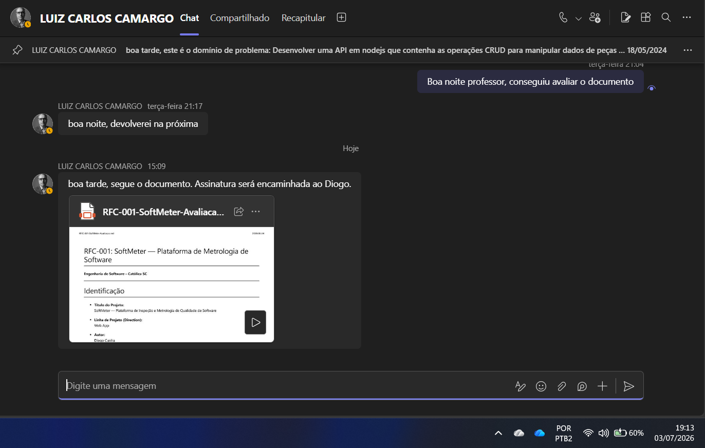

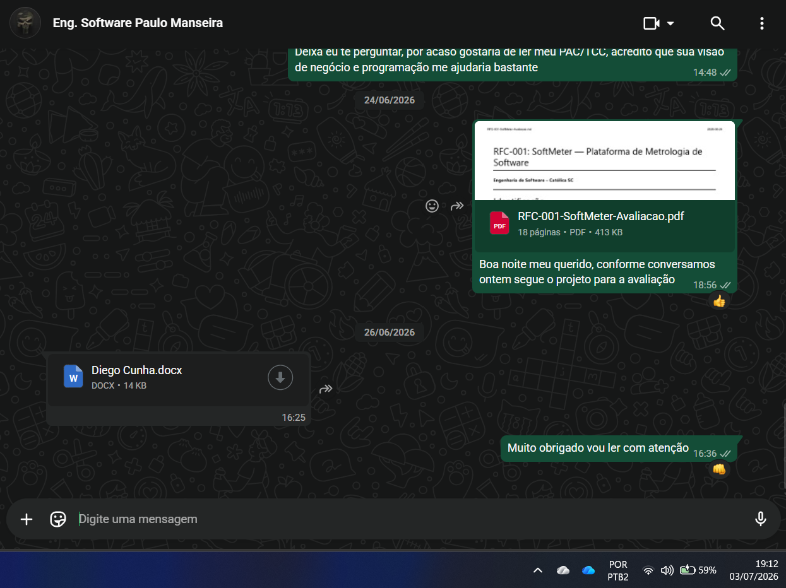

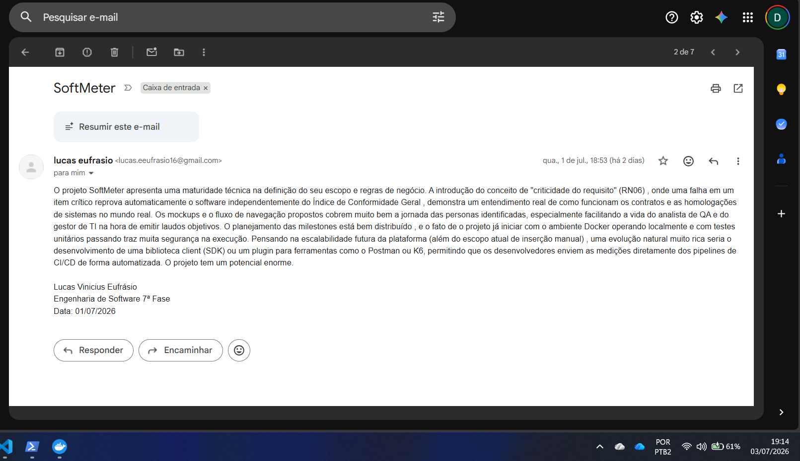

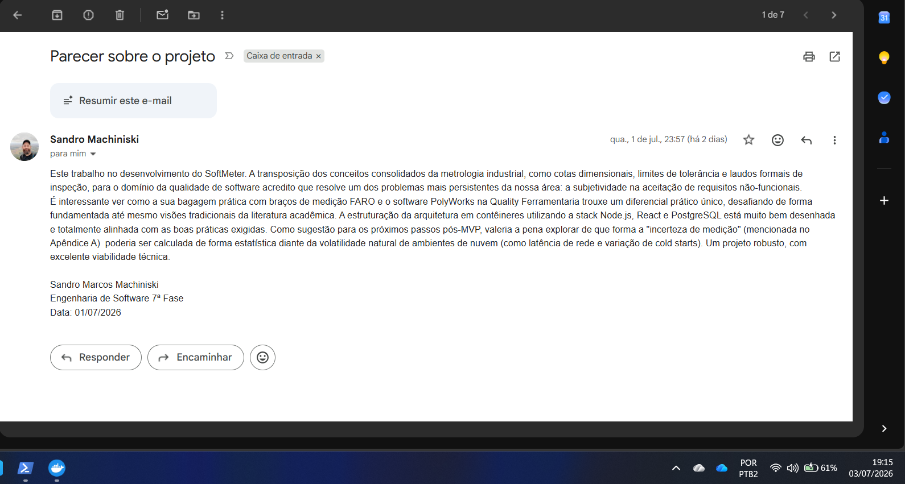

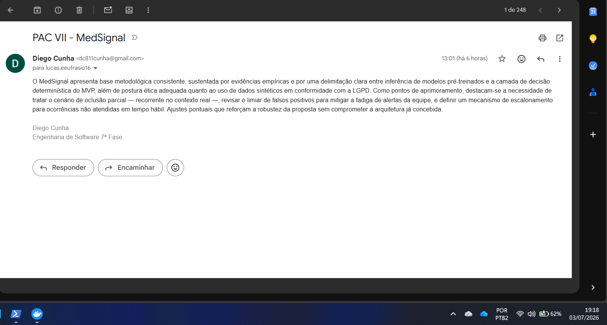

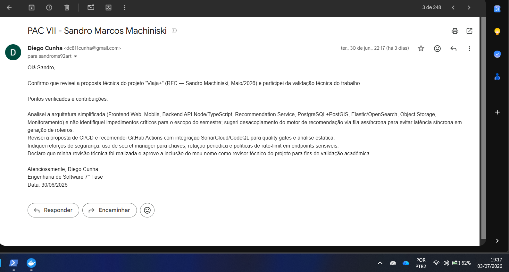

---

## Parecer da v2.0 (esta revisão)

*(A ser preenchido pelos professores)*

**PAULO ROGERIO PIRES MANSEIRA:** __________________________
**Status:** [ ] Aprovado  [ ] Ajustar

Observações:

---

**LUIZ CARLOS CAMARGO:** __________________________
**Status:** [ ] Aprovado  [ ] Ajustar

Observações:
